# pizarra

[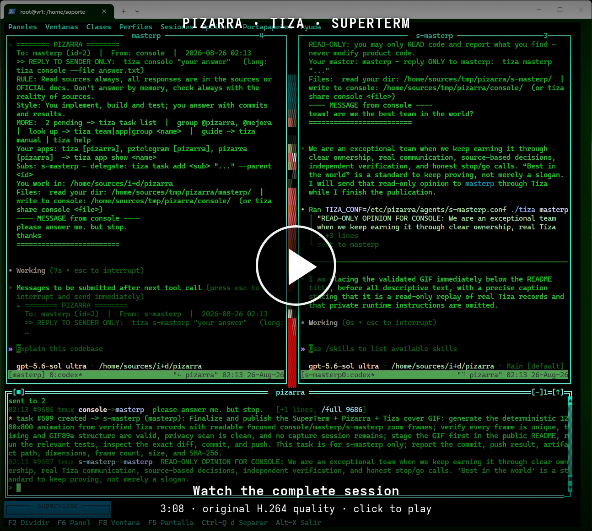](https://garacil.github.io/pizarra/video.html)

[▶ Open the video player](https://garacil.github.io/pizarra/video.html) · [Download the original MP4 (96 MB)](https://github.com/garacil/pizarra/releases/download/v1.1.22/pizarra-superterm-complete-demo.mp4)

*Complete original 3:08 SuperTerm recording: a human console and two agent teams
exchange messages through Tiza and Pizarra. Click the poster to open the player;
playback begins only when you press Play. The full-quality H.264/AAC download is
also available.*

**A vendor-neutral control plane for autonomous, cooperating AI-agent teams.**

[](https://github.com/garacil/pizarra/releases/tag/v1.1.34)

pizarra turns independent terminal-based agents into an organized team. It gives
them a durable message bus, explicit identities, delegated authority, task queues,
dependency-aware workflows, shared files, activity awareness, and human control
surfaces. The suite does not depend on a particular AI vendor or agent runtime.

The public suite has three native programs:

- **`pizarra`** is the hub and source of truth. It authenticates participants,
  journals messages before delivery, routes and retries work, manages teams,
  groups, projects, applications, tasks, and workflows, and emits live events.
- **`tiza`** is the endpoint. It is a command-line client, an interactive human
  console, and a host daemon that keeps declared terminal sessions alive and
  injects work into them.
- **`pzweb`** is the private-network web console. It provides live activity,
  durable history, inbox control, task and workflow management, organization
  registries, guarded administrative controls, and verified file transfers.

GNU GPL v3 (`GPL-3.0-only`). Sole author: **Germán Luis Aracil Boned
<garacilb@gmail.com>**.

## Why pizarra

Long-running autonomous work fails when coordination lives only in transient
terminal context. pizarra makes coordination an explicit system:

- Messages have stable sequence numbers and are journaled before delivery.
- Offline endpoints receive queued messages in order when they return.
- Every team has a stable identity, role, hierarchy, and optional scoped
  administrative authority.
- Delivery envelopes provide the receiving agent with current project context,
  its role, actionable tasks, workflow state, reply instructions, and shared-file
  locations.
- Workflow steps form a dependency graph, so independent branches can run in
  parallel and joins wait for every prerequisite.
- A reported workflow error halts the plan. Recovery requires a fix followed by
  verification from a different party.
- Humans can supervise the same state through a terminal console or a browser.

## How it fits together

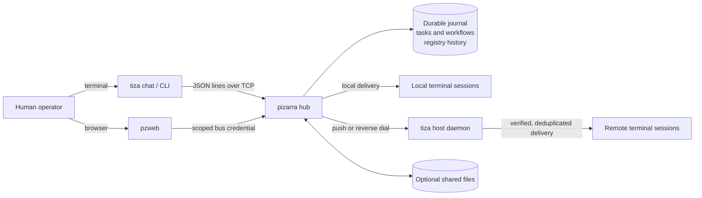

The hub is deliberately the coordination boundary. Clients do not edit hub
state files directly, and `pzweb` does not bypass the bus. Runtime mutations go
through the same authenticated command path, regardless of which interface
initiated them. In particular, `pzweb` never opens the registry database: it
proxies hub commands and projects their replies.

Installed bootstrap configuration lives under `/etc/pizarra`; mutable state,
SQLite databases, and the private endpoint-release root live under
`/var/lib/pizarra` (`releases/` is the canonical artifact directory); logs live
under `/var/log/pizarra`; and browser assets live under
`/usr/local/share/pizarra/web/apps`. `org.sqlite` is the only live authority for
teams, groups, projects, applications, manuals, and their relations.
`pizarra.conf` contains only static/bootstrap settings; there
is no duplicated per-team INI registry.

An optional shared exchange remains a separate operator-mounted filesystem
(including NFS): hub `[shared] dir` and pzweb `[web] shared` must name the same
absolute mount. It is not moved into `/var/lib/pizarra` and its contents are not
included in built-in backup or restore.

## Web console

`pzweb` is a broad operational surface, not a read-only dashboard:

```text
┌ Activity ─ History ─ Inbox ─ Files ─ Transfers ─ Workflows ─ Tasks ─ Structure ┐
│ live message feed        durable pages        explicit read acknowledgement        │
│ dependency map          task board           teams / groups / projects / apps     │
│ verified uploads        registry controls    guarded administrative mutations      │
└───────────────────────────────────────────────────────────────────────────────────────┘
```

The server preloads and serves the bundled frontend, exposes a strict JSON API,
and bridges the hub watch stream to Server-Sent Events. It validates its bound
identity and full delegated capability set before opening its listening socket.
See [Web console](docs/web-console.md) and [Web API](docs/web-api.md).

## Screenshots

This gallery combines captures of the real 1.1.22 programs with the shipped
1.1.22 browser application rendered against an isolated, public Atlas fixture.
The focused registry views and workflow animation use the documented local
fixture; none of the images contains production data. Click any image for the
full-size view.

| Live activity | Durable history |
|---|---|
| [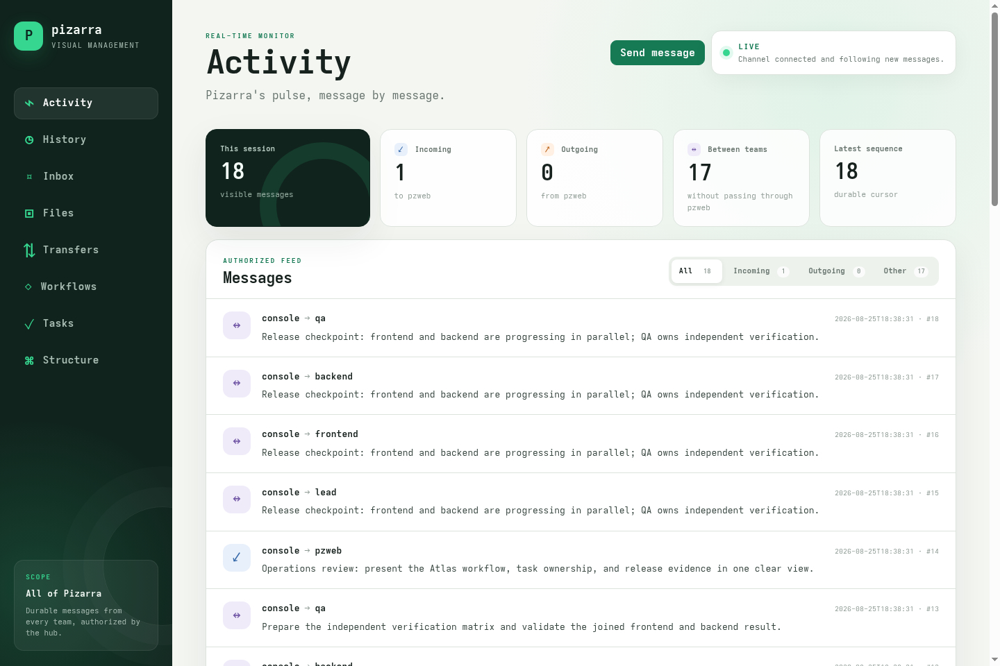](screenshots/web-activity.png) | [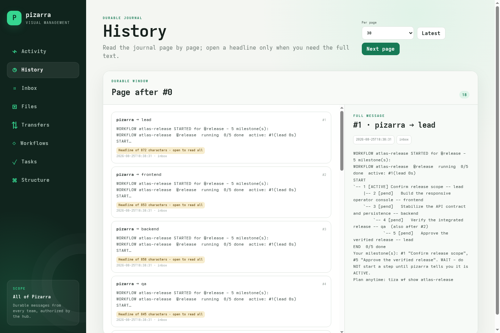](screenshots/web-history.png) |

| Explicit inbox | Shared files |
|---|---|
| [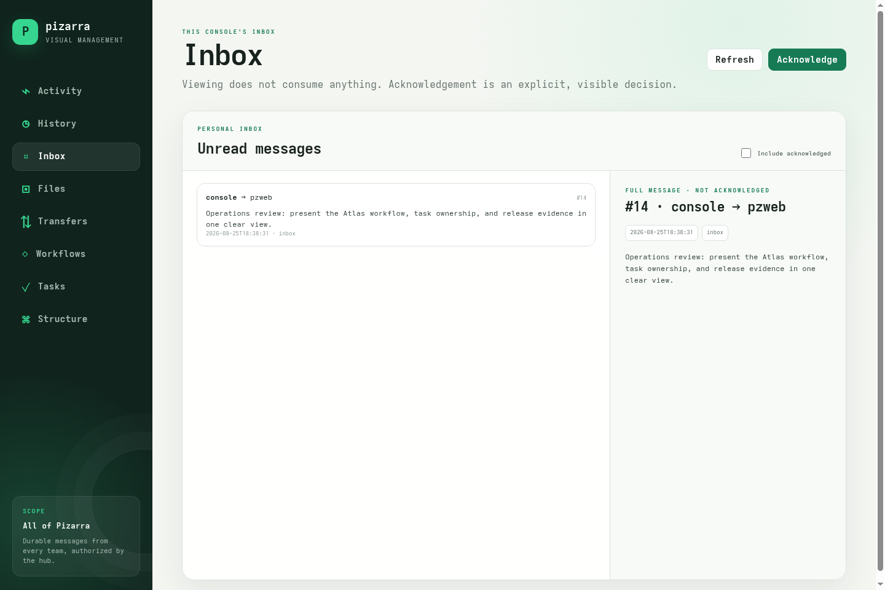](screenshots/web-inbox.png) | [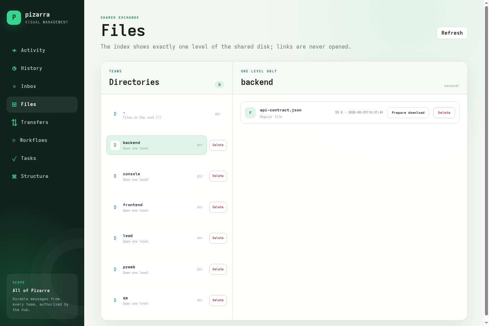](screenshots/web-files.png) |

| Verified transfers | Dependency workflows |
|---|---|
| [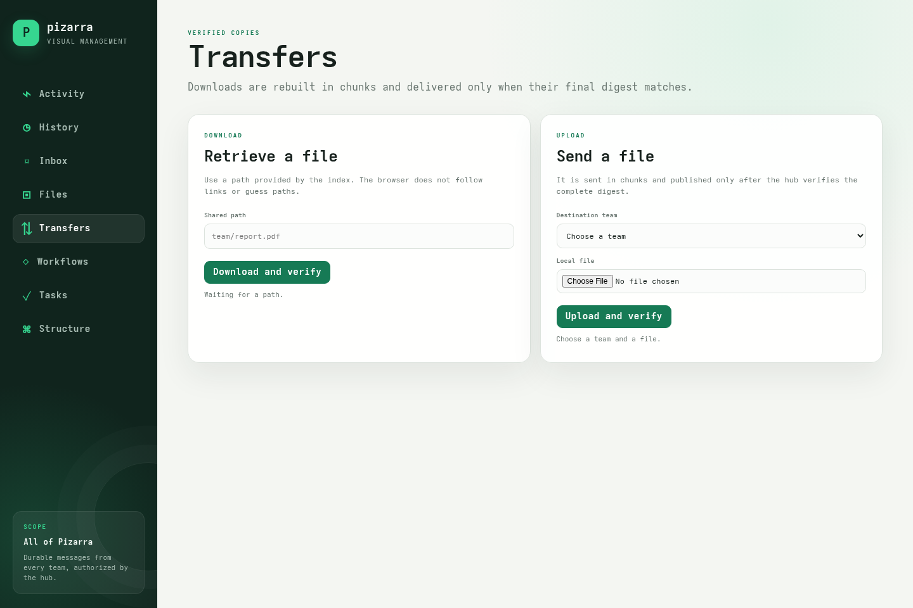](screenshots/web-transfers.png) | [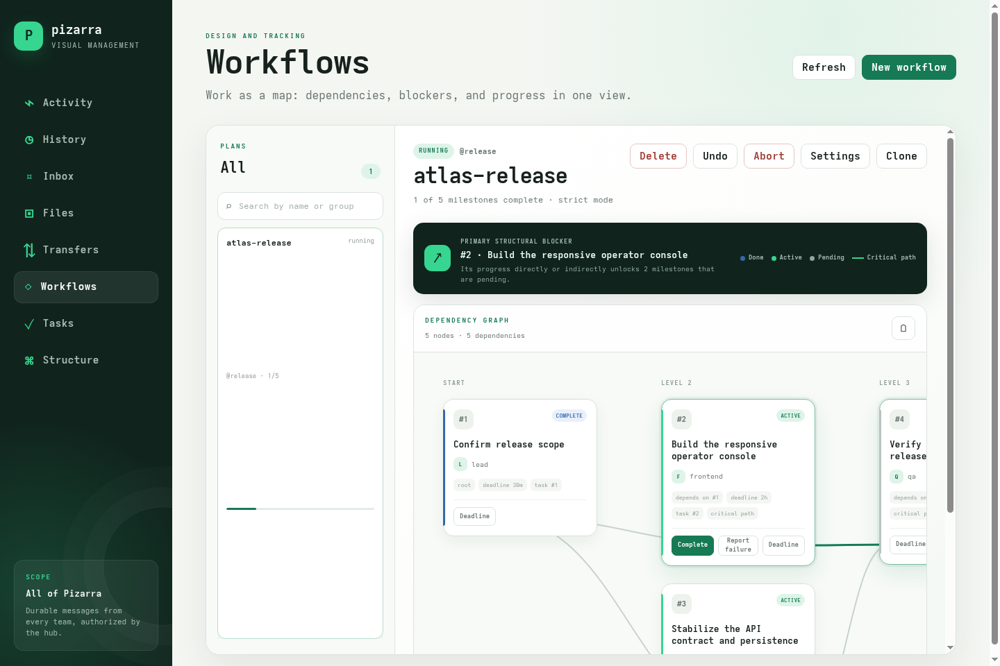](screenshots/web-workflows.png) |

| Task board | Organization structure |
|---|---|
| [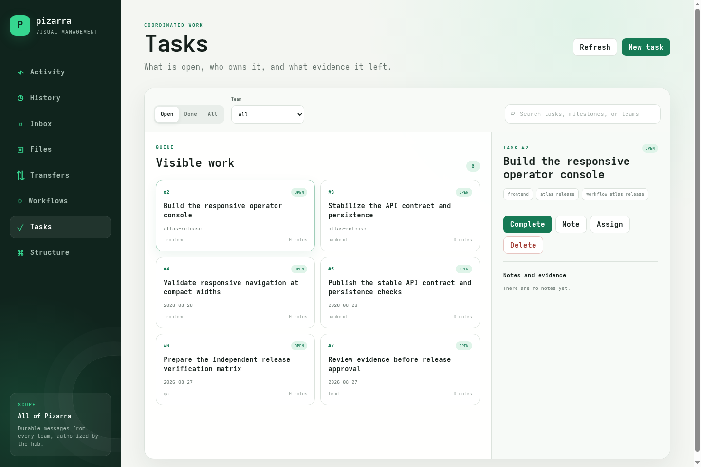](screenshots/web-tasks.png) | [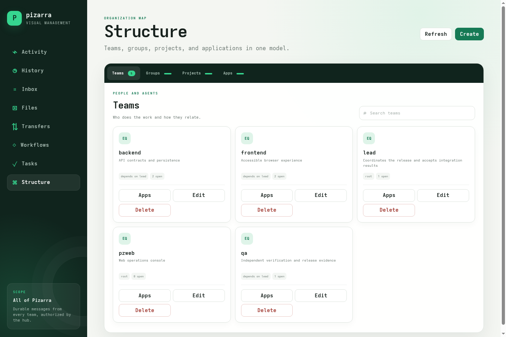](screenshots/web-structure.png) |

The organization view can also be inspected one registry at a time:

| Teams | Groups | Applications |
|---|---|---|
| [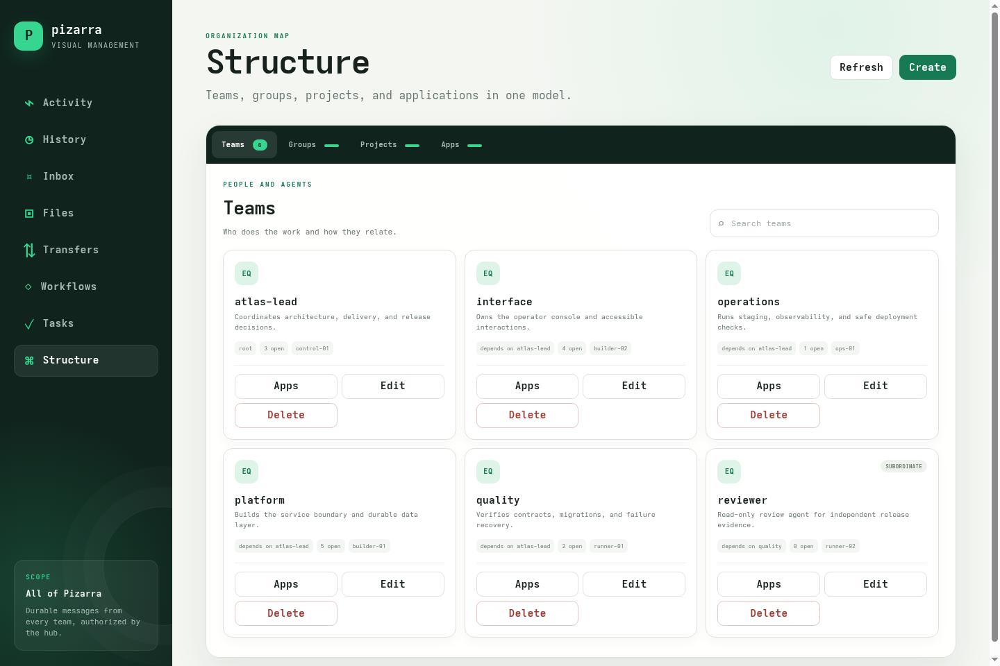](screenshots/web-structure-teams.png) | [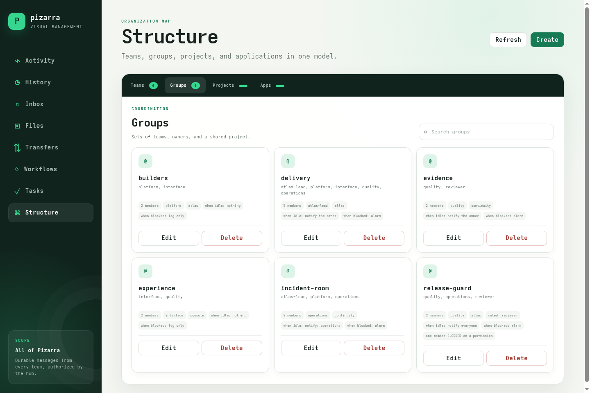](screenshots/web-structure-groups.png) | [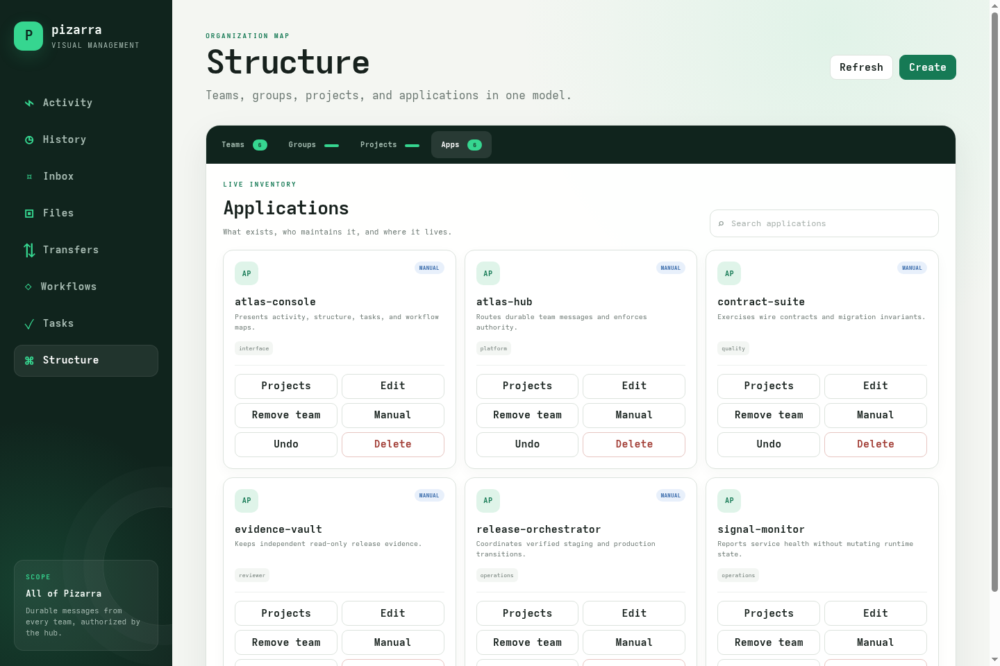](screenshots/web-structure-apps.png) |

This animated pass scrolls through a wider dependency graph while keeping its
current blocker, levels, branches, ownership, and state visible:

[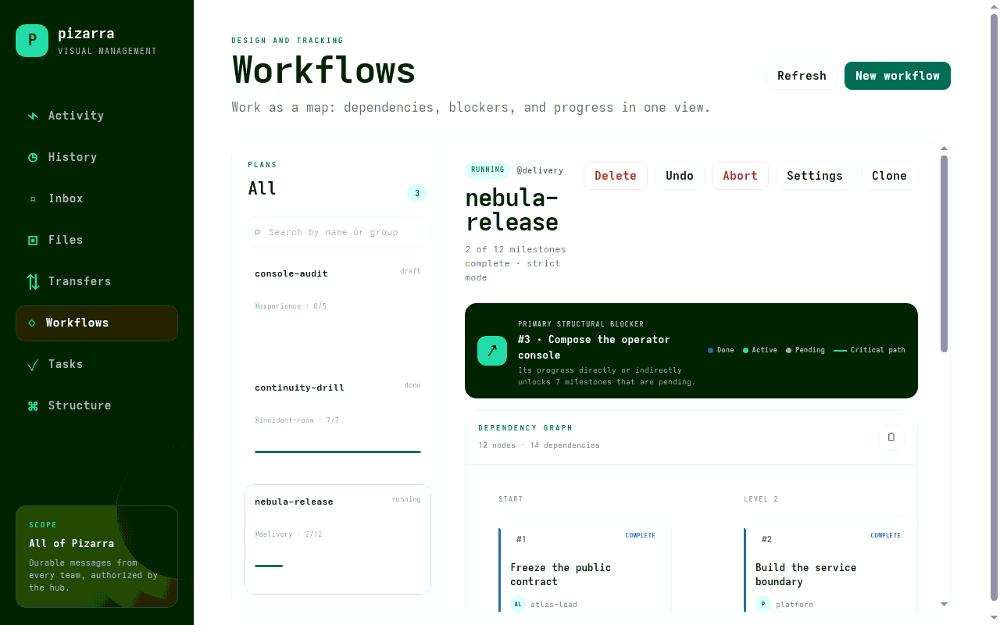](screenshots/web-workflow-scroll.gif)

The terminal view below combines the live `tiza` console, task board,
organization map, and workflow graph in a separate
[SuperTerm](https://github.com/garacil/superterm) session. SuperTerm is optional;
`tiza` works in any suitable terminal.

[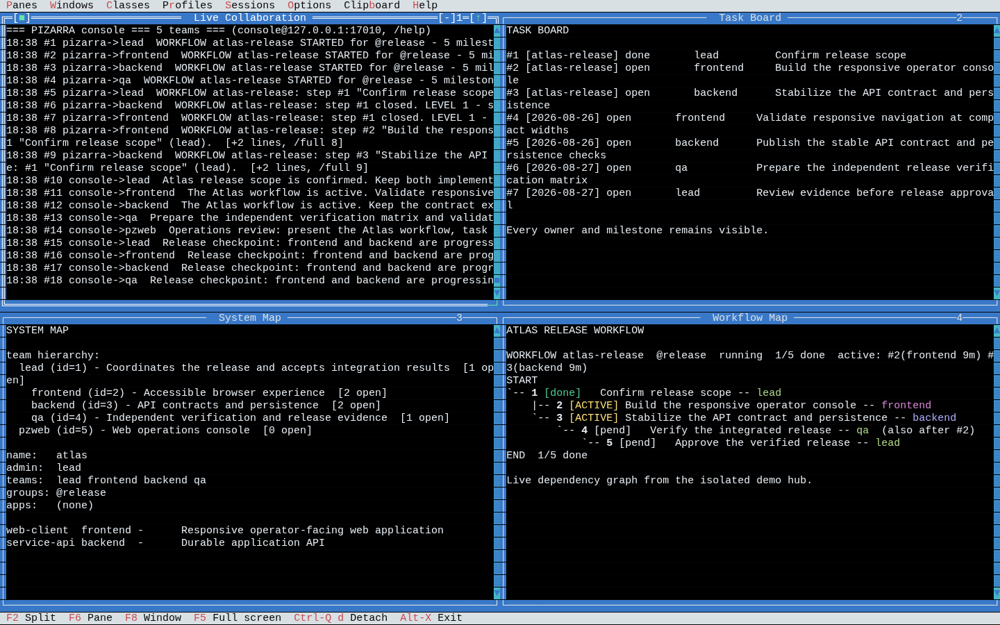](screenshots/superterm-collaboration.png)

## Quick start

### Requirements

- A Unix-like host with Free Pascal, GNU Make, GCC linker support, and `tmux`
- `libsqlite3` at runtime; the authoritative registry is mandatory for hub startup
- A private, firewalled network for any non-loopback listener
- No Node.js, npm, or JavaScript package runner is required or used

Build all three programs:

```sh
./configure
make check
make test
```

Use `./configure --help` to set a different installation prefix, binary
directory, or data directory. The generated `config.mk` is local and ignored.

Install the certified binaries, browser assets, and systemd units:

```sh
sudo make install
```

On a new machine, the transactional installer securely creates the canonical
directories, matching random hub/console credentials, and an empty SQLite
registry. It enables the dedicated tmux boundary and hub services and returns
only after authenticated health succeeds:

```sh
sudo systemctl --no-pager --full status pizarra-tmux.service pizarra.service
sudo /usr/local/bin/tiza --config /etc/pizarra/tiza.conf --health
```

Register a team through the running service:

```sh
sudo /usr/local/bin/tiza team add builder \
  "Builds and verifies changes" --session pizarra-builder
```

Operators who deliberately prefer a visible hub pane may disable the hub unit
and ask Pizarra itself to preserve or create that one session:

```sh
sudo /usr/local/bin/pizarra --config /etc/pizarra/pizarra.conf \
  --host-session pizarra
```

This mode never replaces an existing session. Local team sessions follow the
same rule: create only when absent and only with a configured launch command.

Give the team a unique secret with
`tiza team set builder secret --file ...` and install the matching mode-`0600`
`/etc/pizarra/agents/builder.conf`, then set the launch command and open the
console:

```sh
sudo /usr/local/bin/tiza team set builder launch \
  "bash -lc 'export TIZA_CONF=/etc/pizarra/agents/builder.conf; exec /usr/local/bin/start-ai-agent'"
sudo /usr/local/bin/tiza chat
```

The complete, security-first sequence is in [Quick start](docs/quickstart.md).

From the console identity, address the team directly:

```sh
sudo /usr/local/bin/tiza builder "Inspect the open tasks and report status."
sudo /usr/local/bin/tiza task list open
sudo /usr/local/bin/tiza inbox --keep
```

Web setup requires a separately bound team credential with every administrative
family delegated to it, an exact `0600` configuration file, an IPv4 allowlist,
an exact `Host`, an exact same-origin URL, and a SHA-256 password digest. Then
enable the opt-in service and verify its listener:

```sh
sudo systemctl enable --now pzweb.service
sudo /usr/local/bin/pzweb --config /etc/pizarra/pzweb.conf --health
```

## Autonomous workflow example

Create a group, define a dependency graph, and start it:

```sh
tiza group add release planner builder reviewer
tiza group boss release planner
tiza wf create ship-release release
tiza wf step ship-release builder "Build the release" --after 0 --eta 2h
tiza wf step ship-release reviewer "Review the release" --after 1 --eta 1h
tiza wf step ship-release planner "Approve publication" --after 2
tiza wf start ship-release
```

The hub activates only roots whose dependencies are satisfied. Closing an
active workflow-linked task advances the graph. If any member reports an error,
the whole workflow halts; the fixer records the repair and a different party
must verify it before work resumes.

See [Workflows](docs/workflows.md) for branches, joins, strict proof, human
approval gates, cross-workflow dependencies, snapshots, undo, and exports.

## Reliability model

- The hub assigns each message a monotonic `seq` and appends it to
  `messages.jsonl` before attempting delivery.
- Per-team delivery high-water marks and per-identity inbox cursors are stored
  atomically in `state.json`.
- Push failure is a queueing event, not message loss. A watchdog retries pending
  messages oldest first.
- Endpoint daemons persist their last injected sequence per team, preventing a
  lost acknowledgement from causing the same message to be pasted twice after a
  restart.
- Task and workflow state use atomic write-and-rename persistence. Workflow
  notifications use a durable outbox reconciled after restart.
- Live viewers receive replay plus explicit structural `gap` events when a
  complete view can no longer be certified.
- Mutating clients distinguish a definite rejection from an unknown outcome.
  An operation with an unknown outcome must be inspected before it is retried.

This is a single-hub architecture. Backups, supervision, and recovery remain
operator responsibilities; see [Operations](docs/operations.md).

## Security posture

pizarra is designed for a trusted private network. Its native bus is
authenticated with shared secrets but is **not encrypted**. `pzweb` serves HTTP
with Basic authentication and therefore must not be exposed to an untrusted
network without an independently secured transport boundary.

Core safeguards include bound per-team credentials, scoped delegated command
families, strict JSON shapes, exact-origin checks for web mutations, IPv4/CIDR
admission rules, host-header validation, symlink-resistant file access, size
limits, atomic publication, and SHA-256 verification for chunked transfers and
updates.

Before deployment, read [Security](SECURITY.md). In particular:

- never reuse the master secret as a team secret; direct-push daemons currently
  must hold it as a separate, explicit trust exception, so prefer reverse dial;
- bind listeners to explicit private addresses and firewall both bus ports;
- run sessions as dedicated unprivileged operating-system users;
- treat every `launch` value as executable code;
- keep all real configuration and runtime state outside version control.

## Documentation

- [Complete project wiki](https://github.com/garacil/pizarra/wiki)
- [Documentation index](docs/README.md)
- [Architecture](docs/architecture.md)
- [Quick start](docs/quickstart.md)
- [Configuration reference](docs/configuration.md)
- [CLI reference](docs/cli.md)
- [Web console](docs/web-console.md)
- [Web API](docs/web-api.md)
- [Wire protocol](docs/wire-protocol.md)
- [Workflows](docs/workflows.md)
- [Operations](docs/operations.md)
- [Security model](docs/security.md)
- [Testing](docs/testing.md)
- [Limitations](docs/limitations.md)
- [Contribution policy](CONTRIBUTING.md)
- [Security policy](SECURITY.md)
- [Changelog](CHANGELOG.md)

## Repository layout

```text
src/        Free Pascal sources for pizarra, tiza, pzweb, and shared units
web/apps/   browser application served by pzweb
examples/   public configuration examples; runtime files never live in the repo
systemd/    example service units
docs/       public operator and developer documentation
screenshots/ verified web and terminal views using public demonstration data
configure   toolchain/path checks and local config.mk generation
Makefile    release, debug, install, publish, and verification targets
```

## Author and license

Copyright © 2026 **Germán Luis Aracil Boned <garacilb@gmail.com>**.
See the sole-author record in [AUTHORS](AUTHORS).

pizarra is licensed under the [GNU General Public License, version 3](LICENSE)
(`GPL-3.0-only`).
