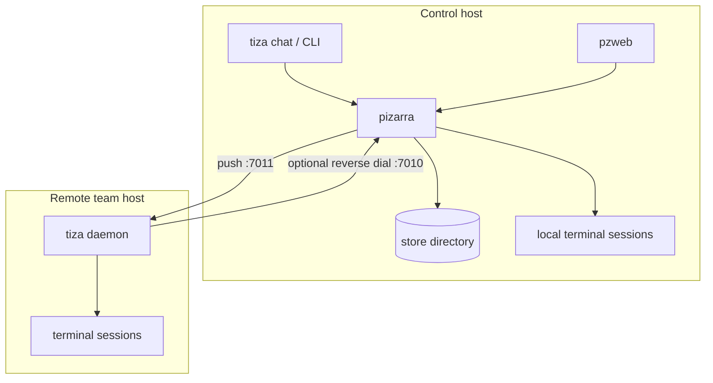
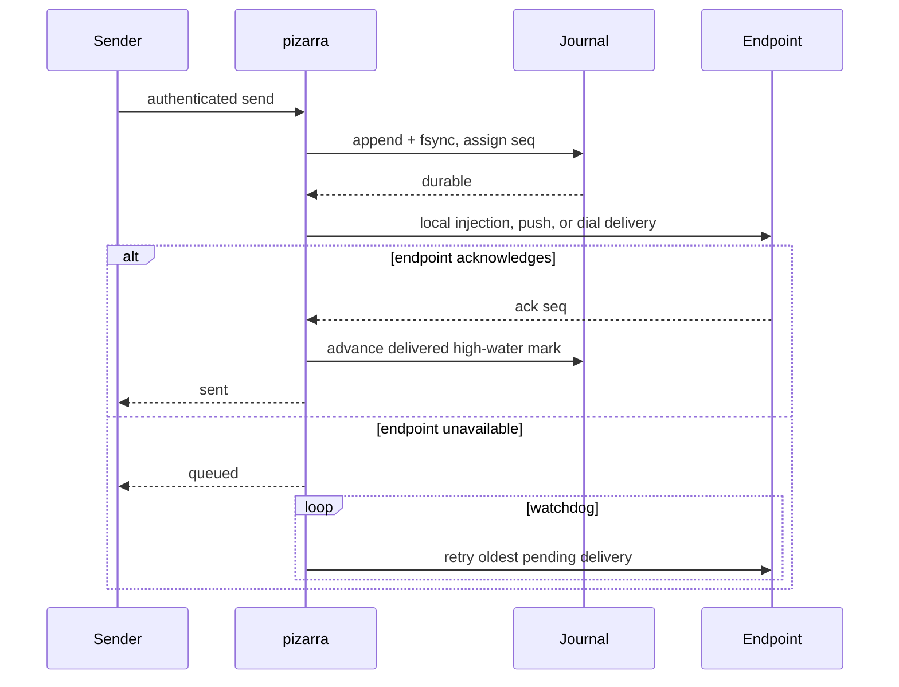

# Architecture

pizarra is a single-hub coordination system. The hub owns durable truth;
clients and consoles submit commands and consume projections of that truth.
Delivery endpoints may run beside the hub or on remote hosts.

## Components

| Component | Responsibilities | Durable local state |
|---|---|---|
| `pizarra` | Authentication, routing, journaling, retry, task/workflow engines, organization registries, delivery headers, live watch streams | Message journal, cursors, task and workflow JSON, workflow snapshots, SQLite registries and history |
| `tiza` CLI | Messages, inbox, tasks, workflows, registries, files, backup, fleet operations | None beyond configuration |
| `tiza chat` | Human terminal console, global feed, command dispatcher, local command history | Shell-side history file |
| `tiza daemon` | Remote delivery, terminal-session watchdog, deduplication, reverse-dial connection, activity reporting, self-update | Per-team last-injected sequence state |
| `pzweb` | Static browser application, authenticated JSON API, strict hub response projection, SSE bridge | No copy of hub state; assets are loaded at startup |

`pzweb` is an authenticated adapter, not another registry reader. Every
organization card and mutation shown in the browser comes from a native bus
request to `pizarra`; the web process never opens `org.sqlite`, registry INI
sections, or the hub's JSON stores.

## Topology

The standard ports are `7010` for the hub, `7011` for a host daemon, and
`7080` for the web console. All are configurable.

## Delivery modes

A team resolves to exactly one delivery mode:

1. **Local session**: `tmux_session` is set and `host`/`dial` are absent. The
   hub starts the session if needed and injects the wrapped message locally.
2. **Remote push**: `host = address[:port]` is set. The hub sends a `deliver`
   request to a `tiza daemon` on that host.
3. **Reverse dial**: `dial = on` is set with no push host. The remote daemon
   opens and maintains an authenticated connection to the hub; useful behind
   NAT or with a changing address.
4. **Inbox only**: there is no host and the normalized session is empty
   (`tmux_session = -`). Messages are journaled and marked delivered for retry
   purposes; the member reads them with `tiza inbox`.

Terminal delivery uses a named buffer, bracketed paste, and one explicit Enter.
This preserves multiline messages as one input. A watchdog ensures declared
sessions exist, but it never kills sessions merely because configuration
changes.

## Message lifecycle

The endpoint daemon persists the last injected sequence for each team. If its
acknowledgement is lost, a retry is accepted without a second terminal paste.
This gives durable at-least-once transport with deduplicated terminal delivery.

When the daemon manages a tmux session, it tags that session with its team and,
when the reviewed launch command declares `TIZA_CONF=...`, with the protected
identity-file path. A bare `tiza` inside the session can therefore recover the
right identity without inferring it from the session name or silently using the
host's default console file.

Broadcasts are expanded into one durable message per destination. A partial
fan-out is reported rather than represented as an all-or-nothing operation.

## Delivery envelopes

The hub, not the sender, constructs the final text delivered to a team. A
compact envelope can include:

- sequence, source, destination, timestamp, and verified/claimed identity;
- current project and standing rules;
- team style and organizational role;
- group and project administrators;
- actionable tasks and active workflow responsibilities;
- application ownership;
- shared-file locations and reply commands;
- the embedded quick guide on the first delivery.

Header sections are configurable, but authorization and durable message content
are independent of presentation.

## Identity and authority

Every native request carries `secret`, `cmd`, and normally `from`.

- The master secret is unrestricted unless `master_console_only = on`; with
  that setting it may identify only as `console`.
- A team secret is bound to one team name. It cannot claim another team or the
  console identity.
- Team secrets must be unique and must not equal the master secret; incoherent
  credential configuration prevents hub startup.
- Administrative power is divided into explicit families: `team`, `group`,
  `project`, `app`, `task`, `workflow`, `watch`, `backup`, `update`, and
  `header`.
- Delegation never changes the actor recorded in history. A delegated team acts
  with its own identity.

The web console uses a bound team credential and requires all administrative
families. It proves both the credential binding and capability set before it
starts listening.

## Canonical layout and durable state

Installed bootstrap configuration lives in `/etc/pizarra`, mutable hub state in
`/var/lib/pizarra`, logs in `/var/log/pizarra`, and installed web assets in
`/usr/local/share/pizarra/web/apps`. The only implicit configuration files are
`/etc/pizarra/pizarra.conf`, `/etc/pizarra/tiza.conf`, and
`/etc/pizarra/pzweb.conf`; runtime discovery does not search a checkout, home
directory, or current directory.

The optional shared exchange is deliberately outside this state tree and may
be an NFS mount. Hub `[shared] dir` and pzweb `[web] shared` must identify the
same absolute mount. It is coordination data, not SQLite authority or local hub
state. Those operations preserve its configuration reference, but the external
tree itself is outside built-in migration, backup, restore, and repository
retirement.

`pizarra.conf` holds static/bootstrap settings such as the listener, master
credential, store/log paths, prompts, and delivery-header presentation. All
paths below are relative to its `[store] dir`, canonically
`/var/lib/pizarra`.

| Path | Role |
|---|---|
| `.pizarra-hub.lock` | Persistent mode-`0600` inode whose exclusive lifetime lock prevents two hubs, or a hub and restore, from opening the same store |
| `messages.jsonl` | Append-only live message journal |
| `state.json` | Next sequence, delivery high-water marks, inbox cursors |
| `tareas.json` | Authoritative task cards and notes |
| `workflows.json` | Authoritative workflows and their durable notification outbox |
| `wfhistory/*.json` | Automatic pre-change workflow snapshots; newest 30 per workflow |
| `appdocs/*.md` | Legacy application-manual migration input, if retained |
| `org.sqlite` | Authoritative teams, groups, memberships, policies, projects, applications, manuals, app/project relations, and audit history |
| `work.sqlite` | Task projection and history |
| `apps.sqlite` | Legacy compatibility/migration database retained for rollback; not current app authority |
| `backups/` | Default destination for built-in backup sets |
| `releases/` | Canonical private endpoint-artifact root; operational release state, not registry authority and not part of the built-in backup |

The lock file is metadata, not a PID file or a stale-lock marker. Its pathname
remains present while the unlocked/locked state belongs to an open descriptor;
do not delete or replace it during cleanup. `CLOEXEC` prevents managed tmux
children from accidentally keeping the hub's lock after the hub exits.

`org.sqlite` is the only live organization authority. Registry mutations commit
to it before a new in-memory projection is published; `pizarra.conf` is not
rewritten with teams, groups, projects, or applications. If SQLite is missing,
cannot be opened, cannot be upgraded, or cannot be loaded completely, the hub
refuses startup instead of resurrecting a partial INI view.

Legacy registry sections are accepted only during the guarded first cutover.
The hub reconciles and verifies them, preserves an owner-only INI backup,
removes those sections atomically, and writes the SQLite authority marker last.
Thereafter an INI registry is neither read as authority nor maintained as a
mirror.

## Task and workflow relationship

Each workflow step projects to a task. The workflow card is authoritative for
the dependency graph; the task is the team's actionable work surface. Closing a
linked active task goes through the same workflow gate as `tiza wf done`.

Workflow transitions persist state and outbound notices together. The hub then
drains that outbox into the durable message journal and removes an entry only
after the append succeeds. Startup and watchdog reconciliation repair incomplete
projections and resume pending notices.

## Live streams

The native `watch` command is a persistent JSON-line stream. On connection, the
hub replays visible history after the requested cursor and then switches to live
events. It emits `gap` when queue overflow, replay limits, unavailable history,
or a cursor ahead of known history prevents a complete view.

`pzweb` projects this stream to SSE. Sequence-number jumps are normal for a
scoped credential; only an explicit `gap` means the view is incomplete.

## Concurrency and failure boundaries

- The hub and host daemon accept TCP connections on detached worker threads.
- Configuration mutations use copy-on-read snapshots and serialized swaps.
- Message, task, workflow, delivery, activity, and database state have separate
  locks with fixed ordering where they interact.
- One slow remote push is not allowed to hold the local-delivery lock.
- One-shot clients retry only connection failures that occurred before a
  request was written. Once written, a lost reply produces an unknown outcome.
- SIGINT and SIGTERM stop listeners, finish watchdogs, and wait for active
  handlers within a bounded shutdown window.

## Trust boundaries

The bus protocol authenticates but does not encrypt. The web server uses
cleartext HTTP. Network confidentiality and stronger perimeter controls must be
provided by the deployment. See [Security](security.md) and
[Limitations](limitations.md).
