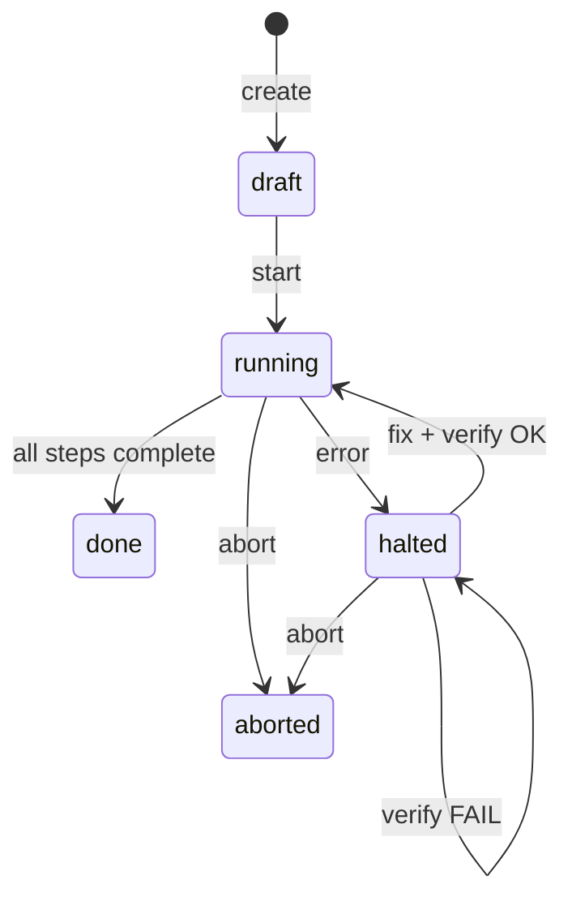
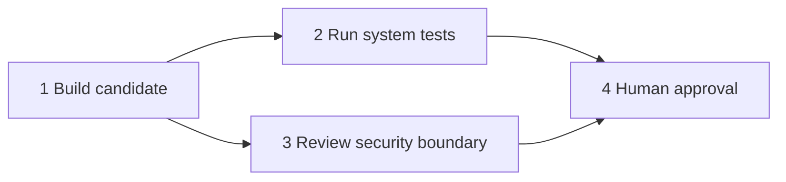

# Workflows

Workflows turn a group objective into a durable dependency graph. Each step has
a stable numeric ID, an owner, a milestone, dependencies, an optional stall
threshold, state, timestamps, and a linked task while it is actionable.

The engine coordinates execution; it does not decide whether an agent's work is
technically correct. Completion evidence, error recovery, and independent
verification make that decision explicit.

## Lifecycle



Workflow states are `draft`, `running`, `halted`, `done`, and `aborted`. Step
states are `pending`, `active`, `done`, `error`, and `fixed`.

Structural edits are draft-only. A running plan changes through ordinary
completion, the error/fix/verify protocol, or abort. Workflow options such as
strict completion evidence and stall thresholds remain adjustable while the
plan is draft, running, or halted.

## Build a graph

Create a workflow for an existing group:

```sh
tiza wf create release-check release
tiza wf step release-check builder "Build candidate" --after 0 --eta 2h
tiza wf step release-check tester "Run system tests" --after 1 --eta 1h
tiza wf step release-check reviewer "Review security boundary" --after 1
tiza wf step release-check console "Approve publication" --after 2,3
tiza wf show release-check
```

`--after 0` declares a root. Omitting `--after` on an appended step makes it
depend on the previous step. A comma-separated list declares a join. Several
steps depending on the same predecessor form parallel branches.



The engine checks the complete graph after every structural mutation and
rejects cycles, missing dependencies, invalid owners, and malformed step IDs.
Step IDs are stable: insertion and removal splice dependency references without
silently renumbering existing work.

## Levels and activation

On start, the hub snapshots the group's current members and activates the
ready roots. Started membership remains stable even if the group is edited
later.

A pending step activates only when:

1. all of its direct dependencies are done;
2. all of its cross-workflow dependencies are done; and
3. every step in every lower topological level is done.

The third rule is a deliberate level barrier. It prevents one branch from
advancing into the next phase while a sibling in the current phase is still
open. All ready steps in the same level activate together.

Activation creates a durable linked task and sends the owner an instruction to
start. Other group members receive the plan but must wait until the hub marks
their own steps active. A reconciliation pass recreates a missing task or
retries a pending notification after a partial failure or restart.

## Run and complete work

Start the plan and inspect its projection:

```sh
tiza wf start release-check
tiza wf show release-check
tiza wf tasks release-check
```

An owner closes its single active step without naming it:

```sh
tiza wf done release-check "Built and checked the release artifact."
```

Name the stable step ID when the actor owns several active steps or when an
authorized administrator is acting explicitly:

```sh
tiza wf done release-check 2 "System suite passed on the supported targets."
```

Only the step owner, group administrator, or console can close a normal active
step. A step owned by `console` is a human approval gate and only the console
may close it.

With strict mode enabled, completion without evidence is rejected:

```sh
tiza wf set release-check strict on
tiza wf done release-check 3 "Reviewed access boundaries and negative cases."
```

Closing a step first commits workflow truth, then projects the result onto its
linked task and activates newly ready work. If that projection fails, the
workflow transition is not rolled back or repeated; reconciliation repairs the
projection later.

## Error, repair, and independent verification

Any current workflow member can report a problem on an active step. A completed
step may also be flagged when later work exposes a defect:

```sh
tiza wf error release-check "Candidate checksum does not match." --step 1
```

The hub immediately:

- snapshots the pre-error state and active set;
- changes the workflow to `halted`;
- marks the affected step `error`;
- stops all advancement, including unrelated branches;
- projects the error to the linked task; and
- notifies the affected owner, active owners, and relevant group members.

The owner repairs and tests the affected step, then records both facts:

```sh
tiza wf fixed release-check "Rebuilt from a clean tree; checksum now matches."
```

That moves the step to `fixed`, but the plan stays halted. Verification must
come from another party: normally the original reporter, otherwise the group
administrator, otherwise the human console. The fixer cannot approve its own
repair, even if it is also the group administrator. The console has an explicit,
logged override.

```sh
tiza wf verify release-check ok "Reproduced the clean build and checksum."
```

An `ok` result restores the affected step to its state before the error and
resumes the frozen work. If the error was found in a previously completed step,
the engine also names downstream active or completed steps that were built on
top of it so operators can reassess them.

A failed verification returns the step to `error` and keeps the workflow
halted:

```sh
tiza wf verify release-check fail "Mismatch remains on a second host."
```

The owner must fix and test again. There is no automatic retry or silent
resumption.

## Cross-workflow dependencies

A dependency may refer to a stable step in another workflow as
`workflow-name#step`:

```sh
tiza wf step deploy-check deployer "Deploy approved release" \
  --after release-check#4
```

Cross-workflow dependencies are checked globally for cycles. Completing the
source step reevaluates dependent running workflows and activates newly ready
work. Renaming is intentionally absent because it would invalidate durable
references.

## Draft editing

Use the stable step IDs displayed by `wf show`:

```sh
tiza wf insert release-check builder "Generate manifest" --after 1 --eta 30m
tiza wf set release-check 2 milestone "Run release system tests"
tiza wf set release-check 2 after "1,5"
tiza wf set release-check 2 team tester
tiza wf set release-check 2 eta 90m
tiza wf remove release-check 5
```

Removing a draft step splices its predecessors into its dependants, then
revalidates the complete graph. `after` accepts a dependency expression;
durations accept `s`, `m`, `h`, or `d` suffixes.

Clone a plan into a pristine draft when the executed plan should remain an
immutable record:

```sh
tiza wf clone release-check release-check-next --group release
```

The clone retains structure and options but resets state, tasks, timestamps,
error data, notifications, and logs.

## Stalled-step reminders

Each active step can have an ETA threshold. Resolution order is:

1. step `eta`;
2. workflow default `eta`;
3. factory default of 24 hours.

Use `off` to disable reminders and `factory` to restore the default:

```sh
tiza wf set release-check eta 4h
tiza wf set release-check 2 eta 45m
tiza wf set release-check 3 eta off
```

The watchdog measures silence since the newest of activation, a linked-task
note, or the previous reminder. It nudges the owner and, when different, the
group administrator. Halted workflows are never nudged. Add a task note to
record progress and reset the silence clock.

## Snapshots, undo, restore, and export

The engine snapshots the full workflow store before every successful mutation
and retains the newest 30 snapshots per workflow. Inspect history and restore a
point:

```sh
tiza wf history release-check
tiza wf undo release-check
tiza wf undo release-check <snapshot-id>
```

Undo is itself a mutation, so the current state is snapshotted before the jump.
This permits a later jump back to the state that was replaced.

Save a restorable JSON document or export for external review and tooling:

```sh
tiza wf save release-check release-check.wf.json
tiza wf restore release-check release-check.wf.json
tiza wf export release-check release-check.sqlite
tiza wf export release-check release-check.sql
tiza wf export release-check release-check.mmd
tiza wf export release-check release-check.dot
```

The saved JSON form is restorable. SQLite and SQL are structured exports;
Mermaid and DOT are visualization exports. Restore validates the complete plan
before replacing durable state.

## Abort and delete

Abort stops a running or halted plan and cancels its open linked tasks:

```sh
tiza wf abort release-check "Publication was withdrawn."
```

Deletion removes an eligible workflow and unlinks its task projections. It does
not erase task history. Prefer keeping completed and aborted plans as audit
records unless retention policy requires deletion.

## Operating rules

- Never start work merely because a step appears in the plan; wait for
  `active`.
- Record meaningful test evidence, especially in strict workflows.
- Report a discovered defect on the plan, even when its original step is done.
- Do not bypass a halt by manually reopening or closing linked tasks.
- After an unknown command outcome, read `wf show` before trying again.
- Use task notes for progress; they feed both human history and stall detection.
- Back up workflow state and snapshots together; see
  [Operations](operations.md).
